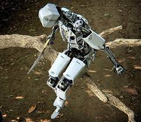

# Hi, I am Venkat !!

I am a passionate graduate student seeking a dynamic role in a forward‑thinking company, committed to applying programming
and machine learning skills to advance innovations in computer vision. Striving to contribute clean code and robust software
engineering capabilities, with a keen interest in opportunities within machine learning, computer vision, or data science.

 

## Education

| Degree                          | University                                     | Duration         |
|---------------------------------|------------------------------------------------|------------------|
| M.S., Computer Science          | Oregon State University                       | Sep 2022 - present |
| B.Tech., Electronics and Communication | PES University                          | June 2022        |

 

## Skills

  
  
  
  
  
  
  
  
  

 

Other Skills (things I have **not** used extensively as above)

- C++
- Docker
- MLFlow
- ROS
- Unity
- OpenAI Gym
- Postgres
    

 

## Machine Learning (research) interests

- Computer Vision (3D / 2D)
- Deep learning
- Reinforcement Learning
- Robotics (ROS)
 

## Experience

**Graduate Research Assistant @ Oregon State University (_Sep 2022 - Present_)**
- Developed computer vision‑based trajectory prediction algorithms, achieving 92% accuracy in detecting physics violations across diverse scenarios for the Passive Violation Of Expectation challenge of
   DARPA Machine Common Sense Challenge.
   
- Currently working on Sim to real experiments and point cloud based object detection (3D Vision). Working on TR3D (Point cloud 3D object detection) for custom data (for all rotations across the axes).

  

  
Experiments

  
  - Research focused on capturing inter‑object and object‑environment interactions at long ranges, exploring 3D and point cloud versions.
  - Leveraged the Region Proposal Interaction Network to enhance model performance, yielding remarkable results on our custom MCS DARPA dataset
  - Used Motion Indeterminacy diffusion model for diverse trajectory prediction for intuitive physics experiments.
    
  

