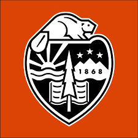

# Hi, I am Venkat !!

I am a passionate graduate student seeking a dynamic role in a forward‑thinking company, committed to applying programming
and machine learning skills to advance innovations in computer vision. Striving to contribute clean code and robust software
engineering capabilities, with a keen interest in opportunities within machine learning, computer vision, or data science.

 

## Education

| Degree                          | University                                     | Duration         |
|---------------------------------|------------------------------------------------|------------------|
| M.S., Computer Science          | Oregon State University                       | Sep 2022 - present |
| B.Tech., Electronics and Communication | PES University                          | June 2022        |

 

## Skills

  
  
  
  
  
  
  
  
  

 

Other Skills (things I have **not** used extensively as above)

- C++
- Docker
- MLFlow
- ROS
- Unity
- OpenAI Gym
- Postgres
    

 

## Machine Learning (research) interests

- Computer Vision (3D / 2D)
- Deep learning
- Reinforcement Learning
- Robotics (ROS)

 

## Experience

** Graduate Research Assistant @ Oregon State University (_Sep 2022 - Present_)**

- Developed computer vision‑based trajectory prediction algorithms, achieving 92% accuracy in detecting physics violations across diverse scenarios for the Passive Violation Of Expectation challenge of  DARPA Machine Common Sense Challenge.
- Currently working on Sim to real experiments and point cloud based object detection (3D Vision). Working on TR3D (Point cloud 3D object detection) for custom data (for all rotations across the axes).

  

    
Experiments

    
      - Research focused on capturing inter‑object and object‑environment interactions at long ranges, exploring 3D and point cloud versions.
      - Leveraged the Region Proposal Interaction Network to enhance model performance, yielding remarkable results on our custom MCS DARPA dataset
      - Used Motion Indeterminacy diffusion model for diverse trajectory prediction for intuitive physics experiments.
    
  

** Robotics intern @ Nokia Bell Labs (NJ) (_Jun 2023 - Aug 2023_)**
- Implemented a state‑of‑the‑art machine vision anomaly detection system, achieving a 91.3% Pixel ROC score by customizing
PaDiM and PatchCore models for a custom PCB dataset, ensuring precise anomaly detection. This was a part of the FlexForce
Digital Twin and Metaverse based system.
- Developed an end‑to‑end pipeline for deploying an Anomaly Detection (AD) overseer app for Nokia Chennai Factory.
Successfully deployed the AD App in real time.
- Collaborated on efficient optimization strategies to improve PaDiM’s performance on the custom PCB dataset.

**Research intern @ Indian Institute of Science (_Jul 2021 - Dec 2021_)**
- Developed Constraint Aware Deep Learning models for resource allocation in Device to Device (D2D) communication and
introduced Lagrangian‑based neural networks to solve optimization problems with constraints in a data‑driven manner to
achieve an impressive 80 % accuracy.

** Student intern @ Nokia (_Feb 2021 - Feb 2022_)**
- Setup ROS, deployed gazebo 3D models for environment and turtlebot sim, created a map for Robot Navigation using teleop.
- Object Detection using SSD Mobilenetv3 and YOLOv3(Python:OpenCV,Tensorflow, C++(basic), Linux)
- Delivered functioning turtlebot that mapped areas of Nokia Bangalore
- Team Awarded ”Best Student Bell Labs Research project” at 2021 Nokia University Conclave

 

## Academic Projects

    
    

        <h4>Learning-Based Motion Planning for Arbitrary Locomotive Systems</h4>
        
A novel motion planning framework for general locomoting systems, beyond car-like robots, integrating dynamically feasible motion primitives using Deep Deterministic Policy Gradients (DDPG) reinforcement learning and an artificial potential field for accurate learning guidance.

        
        

            
Major contributions are:

            <ol>
                <li>Considering the motion planning problem beyond the path planning by considering the dynamically feasible motion primitives.</li>
                <li>Implementing The motion planning framework for general locomoting systems beyond car-like robots.</li>
                <li>Achieving the globally optimal path and giving accurate learning guidance by combining RL with conventional motion planning (the artificial potential field).</li>
            </ol>
        

    

 

    
    

        <h4>Explainable AI for NASA Hirise Mars Project</h4>
        
This project aims to build an explainable CNN model to classify Mars HiRISE images,
providing insights into why the model makes certain classifications. By achieving interpretability, it will enhance trust in the
model’s predictions and help identify biases and prejudices in its decisions.

        
        

            
Major contributions are:

            <ol>
                <li>Weighted sampler and Focal loss for extremely imbalanced data.</li>
                <li>Implemented LIME, SHAP and GradCAM for explainability using heatmaps and class activation maps.</li>
                <li>Covariate shift handles using illumination (openCV LUT) and batch normalization on modified ResNet.</li>
            </ol>
        

    

